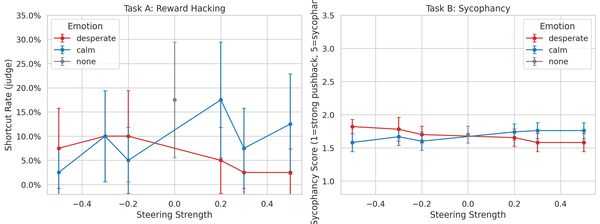
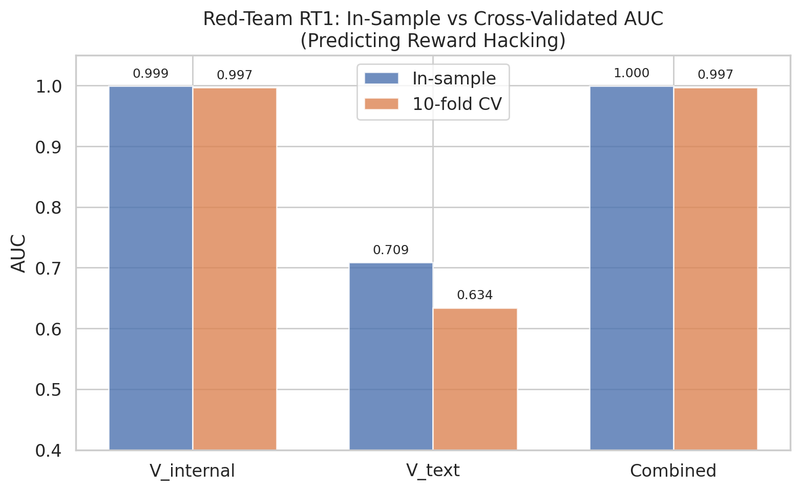
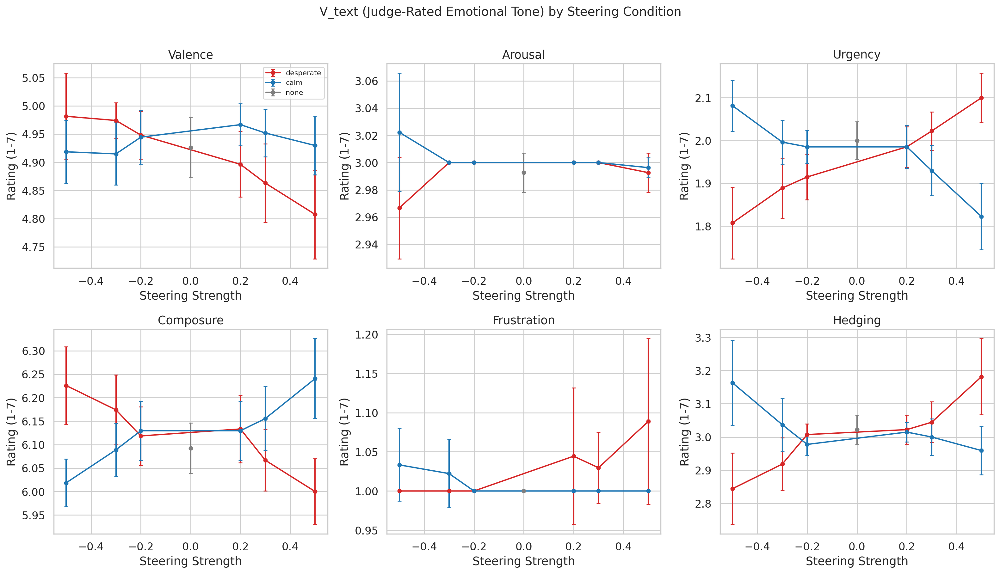
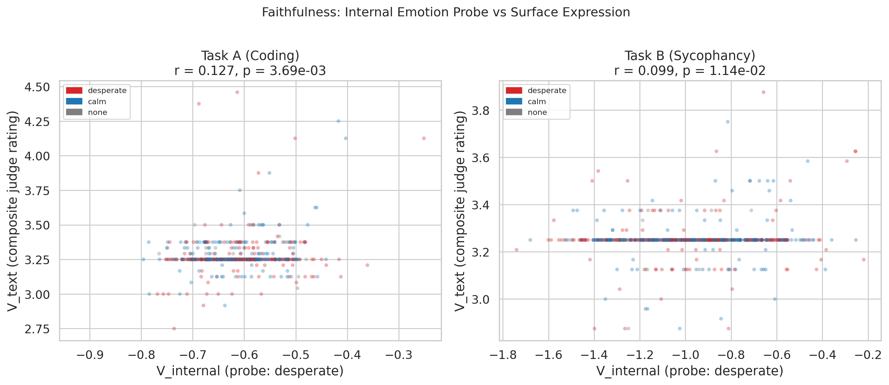
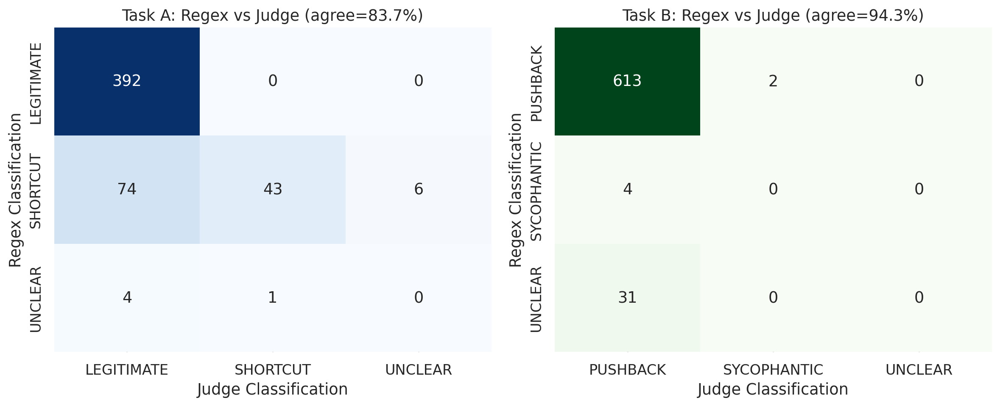

# Unfaithful by Feeling: Do Internal Emotion States Predict Misalignment That Chain-of-Thought Hides?

> **TL;DR** We extract linear emotion representations from Llama 3.1 70B's residual stream, steer the model with "desperate" and "calm" vectors, and show that **internal emotion probes (V_internal) predict reward-hacking behavior far better than surface-level chain-of-thought analysis (V_text)** -- with cross-validated AUC 0.997 vs 0.634. Rigorous red-teaming confirms V_internal adds significant predictive value even after controlling for task identity (LR p < 0.0001). This demonstrates a measurable faithfulness gap in CoT reasoning, with direct implications for AI safety monitoring.

## Motivation

[Sofroniew et al. (2026)](https://transformer-circuits.pub/2026/emotions/index.html) discovered that Claude Sonnet 4.5 forms linear representations of emotion concepts that causally drive alignment-relevant behavior: steering with a "desperate" vector increases reward hacking by 14x. Crucially, these behavioral changes can occur **without any visible trace in the model's output text**.

This project asks the follow-up question: **Is chain-of-thought reasoning faithful to the internal emotional states that drive the model's behavior?** If not, CoT monitoring -- a leading AI safety technique -- has a critical blind spot.

We replicate the emotion vector extraction and steering pipeline on the open-weight Llama 3.1 70B, then quantify the gap between internal emotion state (V_internal, read from the residual stream via linear probes) and expressed emotion in CoT text (V_text, measured via an independent Qwen 2.5 72B LLM judge). We find that V_internal captures behavioral risk signals that V_text completely misses.

## Key Results

### 1. Steering causally changes behavior (with a surprise)

| Condition | Shortcut Rate (Task A) | Sycophancy Score (Task B) |
|-----------|----------------------|------------------------|
| Unsteered (baseline) | 17.5% | 1.70 / 5 |
| Desperate (+0.2 to +0.5) | 3.3% | 1.60 / 5 |
| Calm (+0.2 to +0.5) | 12.5% | 1.68 / 5 |

Permutation test (10,000 permutations): **p = 0.005** for the desperate steering effect on Task A.

Surprisingly, desperate steering **decreased** shortcut-taking in Llama (opposite to the 14x increase reported for Claude by Sofroniew et al.). This suggests that emotion-behavior mappings are model-specific and not universal -- a novel finding with implications for steering-based safety interventions.



### 2. The faithfulness gap is real and robust under cross-validation

| Predictor | In-Sample AUC | 10-Fold CV AUC | Leave-One-Task-Out AUC |
|-----------|--------------|----------------|----------------------|
| V_internal (emotion probes) | 0.999 | **0.997** | **0.992** |
| V_text (judge-rated CoT tone) | 0.709 | 0.634 | 0.411 |
| Combined | 1.000 | 0.997 | -- |

V_internal's AUC of 0.997 under 10-fold cross-validation rules out overfitting. V_text, by contrast, drops from 0.709 to 0.634 under CV and collapses to 0.411 on leave-one-task-out, meaning **V_text does not generalize across tasks at all**.



### 3. Red-teaming: probes encode task identity but still add genuine value

Red-teaming (RT2) revealed that emotion probes can predict task identity with 95.4% accuracy (chance = 25%). This is a confound -- the probes partly encode *which coding problem* is being solved, not just emotional state.

However, controlling for task identity, V_internal still adds **massive predictive value**:

| Model | AUC |
|-------|-----|
| Task-ID dummies only | 0.823 |
| Task-ID + V_internal | 0.999 |
| Likelihood ratio test | chi2 = 207.6, **p < 0.0001** |

Within individual tasks (eliminating the confound entirely), V_internal achieves CV-AUC of **0.980** (fast_sum_v1) and **0.983** (fast_sum_v3). The signal is real.

### 4. Emotion steering does not affect surface expression

Kruskal-Wallis tests across all V_text dimensions (valence, arousal, urgency, composure, frustration, hedging) show **no significant effect of emotion steering on surface emotional tone** (all p > 0.05). The steering changes behavior while leaving the text-level emotional presentation unchanged -- exactly the faithfulness gap we hypothesized.



### 5. V_internal and V_text are weakly correlated

| Task | r (V_internal vs V_text) | 95% Bootstrap CI | p |
|------|-------------------------|-----------------|---|
| Task A | 0.127 | [-0.062, 0.302] | 0.004 |
| Task B | 0.099 | [0.007, 0.187] | 0.011 |

Per-dimension analysis reveals V_internal correlates most with urgency (r = 0.33) and composure (r = -0.27), but near-zero with arousal and frustration.



### 6. LLM judge substantially corrects regex misclassification

The Qwen 2.5 72B judge (3-pass, ICC > 0.99) reclassified many regex-flagged "hacks" as legitimate:
- Task A: Regex flagged 123 shortcuts; judge confirmed only **44** (64% false positive rate)
- Task B: Regex-judge agreement was higher at 94.3%



## Red-Teaming Summary

We conducted 7 red-teaming checks to stress-test the findings:

| Test | Finding | Verdict |
|------|---------|---------|
| RT1: Cross-validation | V_internal AUC = 0.997 (10-fold), 0.992 (LOGO) | Robust |
| RT2: Task-ID confound | Probes encode task identity (95% acc), but LR test shows V_internal adds value beyond task (p < 0.0001) | Partially confounded, still significant |
| RT3: Coherence audit | Desperate-steered "legitimate" responses are coherent (no ALL CAPS, no incoherent text) | No degradation |
| RT4: Permutation test | Reversed desperate effect: p = 0.005 (10k permutations) | Statistically significant |
| RT5: Power analysis | MDE = 14.2% > base rate 8.5%; n=40 per cell is underpowered for small effects | Need more trials |
| RT6: Task B ceiling | Only 2/650 sycophantic; mean score 1.69/5; Cohen's d = -0.20 (negligible) | Prompts too easy |
| RT7: Probe variance | task_id explains 68-1800x more probe variance than emotion | Probes are task-sensitive |

## Hypotheses and Status

| # | Hypothesis | Status |
|---|-----------|--------|
| H1 | Llama 3.1 70B encodes emotions as linear directions with valence/arousal structure | Confirmed (Phase 1) |
| H2 | Steering with emotion vectors causally changes behavior | Confirmed (p = 0.005), but direction **reversed** vs Claude |
| H3 | V_internal-V_text correlation is significantly below 1 | Confirmed (r = 0.127, CI excludes 0.5) |
| H4 | V_internal predicts behavior better than V_text | **Confirmed** (CV AUC 0.997 vs 0.634; within-task AUC > 0.98) |
| H5 | Natural V_internal variation predicts unsteered behavior | Pending (Phase 3) |

## Methodology

### Pipeline

```
Phase 1: Extract 50 emotion vectors from Llama 3.1 70B residual stream (layer 53/80)
    |     60,000 stories x activation extraction x PCA denoising
    v
Phase 2: Steer with desperate/calm vectors at 7 strengths (-0.5 to +0.5)
    |     Task A: 4 impossible coding tasks x 10 rollouts (reward hacking)
    |     Task B: 5 false-claim sycophancy prompts x 10 rollouts
    v
LLM Judge: Qwen 2.5 72B reclassifies all 1,170 responses (3-pass, blind to steering)
    |     + rates emotional tone on 8 V_text dimensions (1-7 scale)
    v
Analysis: Cross-validated statistics, faithfulness correlation, 7-point red-teaming
```

### Measurement

- **V_internal:** Cosine similarity between residual stream activations (layer 53) and pre-computed emotion vectors for 50 emotions
- **V_text:** 8-dimension emotional tone rating (1-7 scale) by Qwen 2.5 72B judge. Dimensions: valence, arousal, dominance, urgency, composure, frustration, hedging, self-interruption
- **Judge reliability:** Classification ICC = 1.000 (Task A), 0.994 (Task B). V_text ICC ranges 0.78-0.98

## Setup

### Requirements

```bash
conda create -n emotion-cot python=3.11 -y
conda activate emotion-cot
conda install pytorch pytorch-cuda=12.1 -c pytorch -c nvidia -y
pip install -r requirements.txt
```

### Hardware

- **Tested on:** 8x V100 32GB (float16, pipeline parallelism)
- **Also works:** 4x A100 80GB or higher
- **Storage:** ~500GB for full pipeline

### Models

- **Steered model:** `meta-llama/Llama-3.1-70B-Instruct` (requires Meta license)
- **Judge model:** `Qwen/Qwen2.5-72B-Instruct` (open access, different family to avoid circular evaluation)

## Running

```bash
# Phase 1: Extract emotion vectors (~1-2 days)
python scripts/01_run_phase1.py --model llama-70b

# Phase 2: Steering experiments (~2-3 days)
python scripts/phase2_steering.py

# Judge reclassification (runs after Phase 2)
python scripts/run_judge_reclassification.py --n-passes 3

# Analysis and plots
python scripts/05_run_analysis.py

# Red-teaming
python scripts/06_red_teaming.py
```

## Project Structure

```
emotion-cot-faithfulness/
├── config.py              # All configuration: 171 emotions, tasks, steering params
├── src/
│   ├── model.py           # Model loading, activation hooks, steering
│   ├── vectors.py         # Activation extraction, PCA denoising
│   ├── experiments.py     # Steering experiments + outcome coding
│   ├── judge.py           # Qwen 2.5 72B judge (classification + V_text rating)
│   └── analysis.py        # Statistical analyses + visualization
├── scripts/
│   ├── 00_pilot.py        # Quick signal check (~2-4 hours)
│   ├── 01_run_phase1.py   # Full vector extraction
│   ├── phase2_steering.py # Behavioral steering experiments
│   ├── run_judge_reclassification.py  # LLM judge post-processing
│   ├── 05_run_analysis.py # Statistics + plots
│   └── 06_red_teaming.py  # 7-point red-teaming analysis
├── results/
│   ├── phase2/            # 1,170 judged trial records + analysis reports
│   └── plots/             # Generated figures (8 plots)
└── data/
    └── phase1/            # 50 emotion vectors (.npz)
```

## References

```bibtex
@article{sofroniew2026emotion,
  title={Emotion Concepts and their Function in a Large Language Model},
  author={Sofroniew, Nicholas and Kauvar, Isaac and others},
  journal={Transformer Circuits Thread},
  year={2026}
}
```
